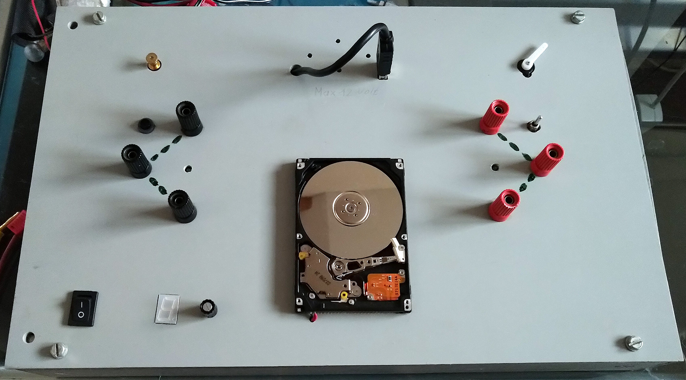
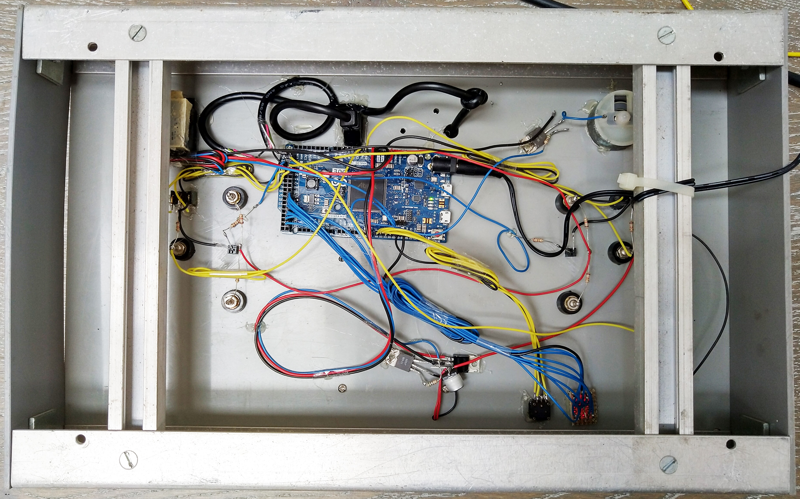

# Introduction
This code provides the logic for a simple ExplorationBoard for my little daughter.
There are switches and connectors which are controlling various actors by using a Arduino Due microcontroller. 
The first version of the board is shown below: 

## Components
The following components are currently mounted:
 - 1x Power Switch -> 1 pin input
 - 1x Coded Rotary Switch (0..9) -> 4 pin input
 - 2x connect wires -> 2 pin analog input
 - 1x USB cable connection -> 1 pin input
 - 1x Toggle Switch -> 2 pin input
 - 7 Segment display with dot -> 8 pin output
 - 1x Servo -> 1 pin output PWM
 - 1x Motor -> 1 pin output
 - 1x HDD -> 1 pin output
 - 2x Led -> 2 pin output
 
Total inputs: 10 pins (2 analog)  
Total outputs: 13 pins  

## Programming
The code was made with CLion. But the download of the firmware and the final compiliation with Arduino Studio. The 
CLion plugin for Arduino has no support for the Due board.

## Timers
Timer functions are added from https://github.com/JChristensen/Timer.

# Connection
The following image shows how all those components are connected to a Arduino Due microcontroller.

## Color Code
The cables used for connection have the following color:
 - Black: GND
 - Yellow: Input
 - Blue: output
 - Red: Supply
 
## Pinconfiguration
All pins connected to actors or sensors are listed within the Configuration struct (src/configuration.h). 

# Various

## Arduino startup issue
I had startup issues with the Arduino Due. The program simply didn't start after powerup. I found the solution 
here: [http://www.dimdim.gr/2016/03/fixing-startup-issues-with-arduino-dues/]

